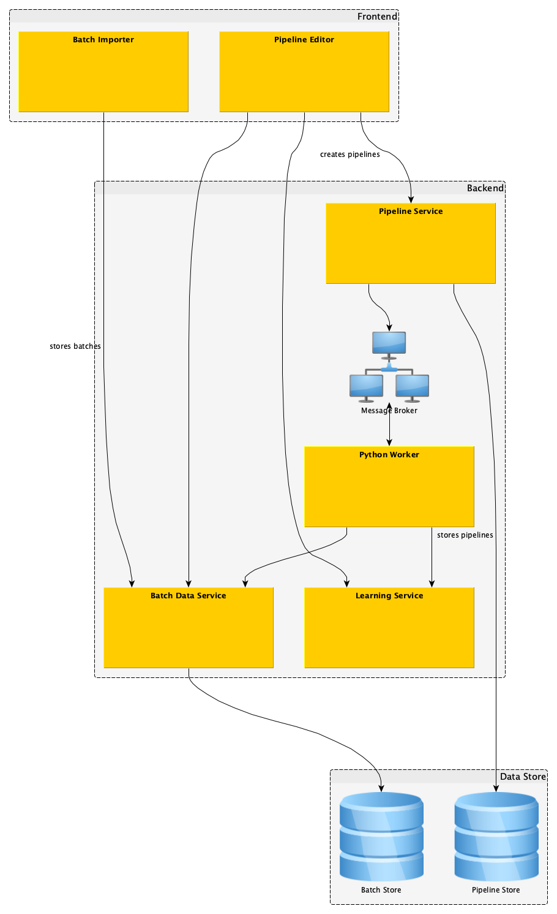
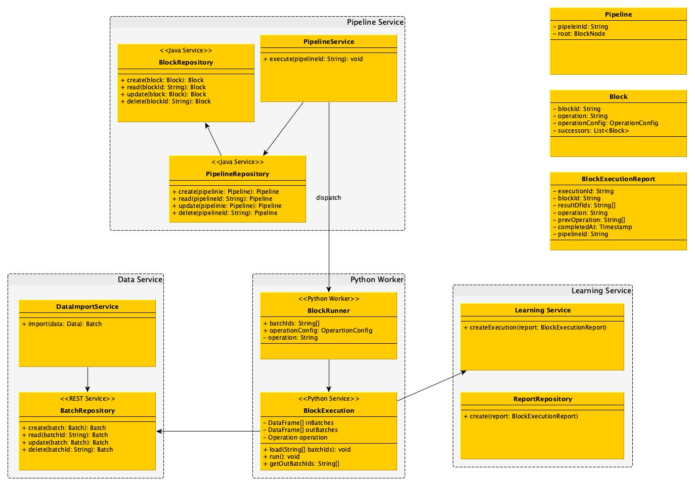

# Hanse Prototype A

First prototype for data processing pipeline of Project Hanse.

## How to use

An installation of [Docker](https://www.docker.com/) and [Docker Compose](https://docs.docker.com/compose/) is required
for running the prototype. Please checkout the installation guides
for [Docker Desktop](https://www.docker.com/products/docker-desktop)
for [Mac](https://docs.docker.com/docker-for-mac/install/)
or [Windows](https://docs.docker.com/docker-for-windows/install/).

For starting the prototype open a shell ([cmd.exe](https://g.co/kgs/U27TRZ) on
Windows, [Terminal](https://g.co/kgs/RH4MXv) on Mac), navigate to the project's root directory and run:
`docker-compose build && docker-compose up`.

You can then open a new browser window and navigate to http://localhost:5000/index.html. You can then test the Pipeline
Service via the provided [Swagger UI](https://swagger.io/tools/swagger-ui/). To stop the prototype go back to your shell
and press <kbd>ctrl</kbd> + <kbd>C</kbd> (this will send a `SIGINT` signal to the prototype telling it to shutdown).

## Architecture

Overview

Class Diagram
