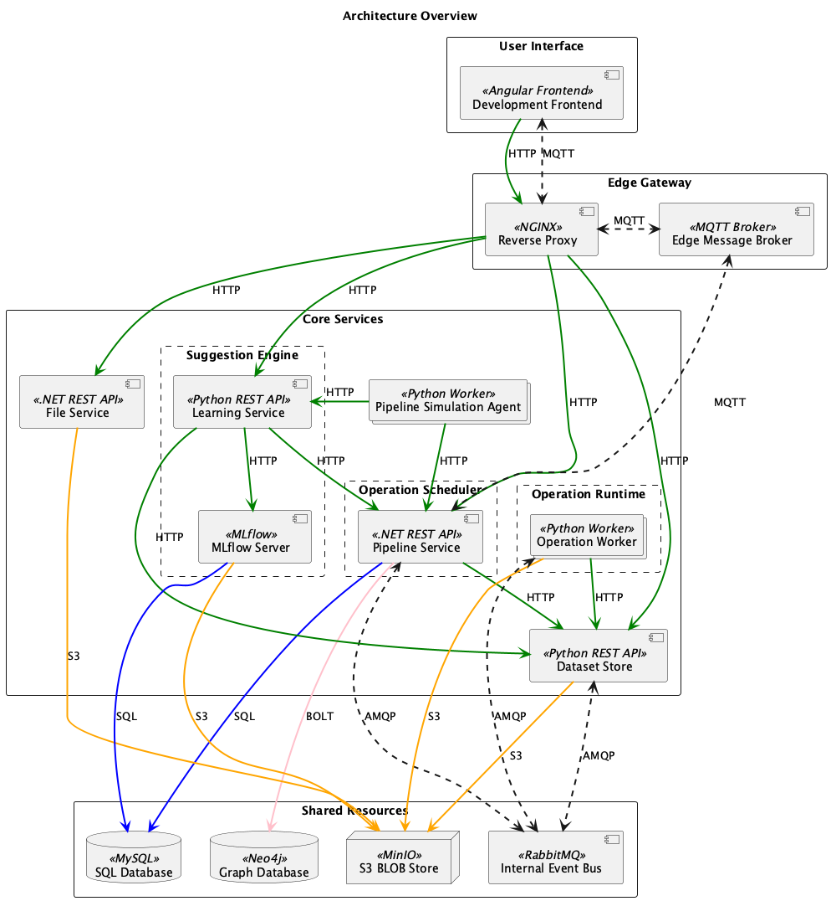
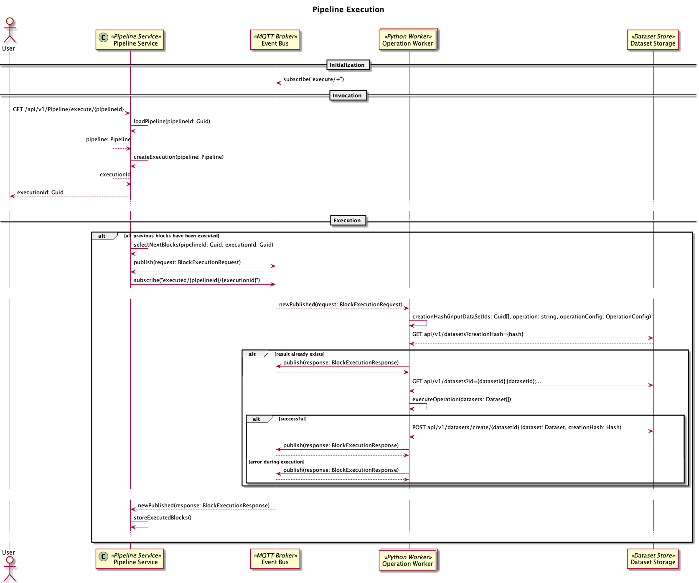

# Project Hanse

The goal of this project is to build a platform that allows non-technical experts to gain insights from data. The
software tool that will be developed should make professional data science tools
like [Pandas](https://pandas.pydata.org/), [NumPy](https://numpy.org/) and potentially others available to them without
the need to learn how to code.

## Concept

In order to accomplish this goal a node based tool (similar to shader nodes
in [Blender](https://docs.blender.org/manual/en/2.81/addons/import_export/io_node_shaders_info.html)) will be used to
model [python](https://www.python.org/) scripts as directed acyclic
graphs ([DAG](https://en.wikipedia.org/wiki/Directed_acyclic_graph)). Each node in this graph will represent a
transformation of one or more dataframes to a new dataframe. By combining multiple nodes using edges (each node can have
0..n input and output edges) so called "pipelines" can be created, that model the steps required to transform raw data
to a visualization (or any other relevant insight).

](https://devopedia.org/images/article/38/3232.1523605852.png)

To further support non-technical experts
an [artificial neural network](https://en.wikipedia.org/wiki/Artificial_neural_network) (built
using [Tensorflow](https://www.tensorflow.org/)) will learn from previously created pipelines and suggest users
potential next nodes while they are building a new pipeline. In a first attempt this suggestion will be based on the
operation (
e.g. `.dropna()` [operation](https://pandas.pydata.org/pandas-docs/stable/reference/api/pandas.DataFrame.dropna.html)
from pandas) of the previous node and metadata (e.g. dimensions, datatypes) about the dataframe that will be
transformed.

A web-based pipeline editor will make those features available. As a first step a user will be able to upload their own
datasets (e.g. csv-files), in the future, however, it should also be possible make this tool available as a platform
that allows trading and sharing of datasets.

## Technical Architecture

### Overview

This is a general overview of the components involved in a somewhat functional system. The first proof of concept will
primarily focus on implementing the communication between the `Pipeline Service`, `Python Workers` and
the `Dataset Store`. All data will be held in-memory and will not be persisted to disk in order to reduce the complexity
of this step. In a second iteration it is planned to also include the `Suggegstion Service` that will allow prediction
of potential next nodes based on previously created pipelines. In a third step a basic frontend (`Pipeline Editor`) will
be implemented.

### Sequence Diagram Iteration 1

The first iteration, implementing the execution of a pipeline, follows this diagram:

## Implementation

The code for the proof of concept is stored in this [git repo](https://github.com/project-hanse/prototype-a).

### How to use

An installation of [Docker](https://www.docker.com/) and [Docker Compose](https://docs.docker.com/compose/) is required
for running the prototype. Please checkout the installation guides
for [Docker Desktop](https://www.docker.com/products/docker-desktop)
for [Mac](https://docs.docker.com/docker-for-mac/install/)
or [Windows](https://docs.docker.com/docker-for-windows/install/).

For starting the prototype open a shell ([cmd.exe](https://g.co/kgs/U27TRZ) on
Windows, [Terminal](https://g.co/kgs/RH4MXv) on Mac), navigate to the project's root directory and run:
`docker-compose build && docker-compose up`.

You can then open a new browser window and navigate to http://localhost:5000/index.html. You can then test the Pipeline
Service via the provided [Swagger UI](https://swagger.io/tools/swagger-ui/). To stop the prototype go back to your shell
and press <kbd>ctrl</kbd> + <kbd>C</kbd> (this will send a `SIGINT` signal to the prototype telling it to shutdown).
