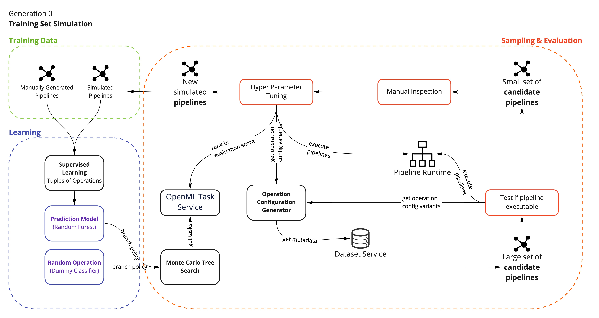
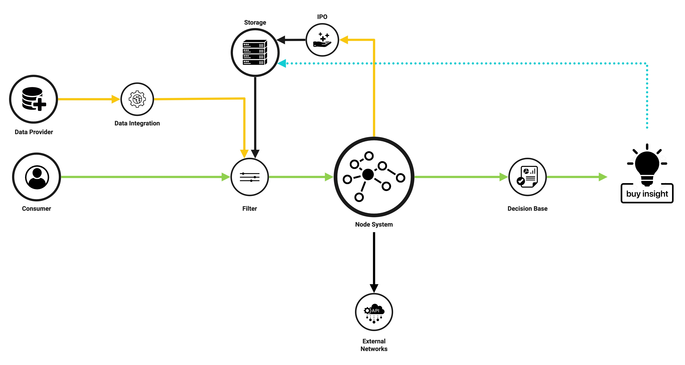

[](https://github.com/project-hanse/prototype-a/actions/workflows/build.yml)

# Project Hanse

The goal of this project is to build a platform that allows non-technical experts to gain insights from data. The
software tool that will be developed should make professional data science tools
like [Pandas](https://pandas.pydata.org/), [SciKitLearn](https://scikit-learn.org/stable/)
, [Prophet](https://github.com/facebook/prophet) and potentially others available to them without the need to learn how
to code.

## Technical Architecture

This is a general overview of the components involved in a somewhat functional system. The first proof of concept will
primarily focus on implementing the communication between the `Pipeline Service`, `Operation Workers` and
the `Dataset Store`. All data will be held in-memory and will not be persisted to disk in order to reduce the complexity
of this step. In a second iteration it is planned to also include the `Suggegstion Service` that will allow prediction
of potential next nodes based on previously created pipelines. In a third step a basic frontend (`Pipeline Editor`) will
be implemented.


The following sections will be adapted and extended as the project progresses.

### Implementation

The code for the proof of concept is stored in this git
repository [https://github.com/project-hanse/prototype-a][git-repo].

The technologies used for this project are primarily [.NET 5](https://dotnet.microsoft.com/download/dotnet/5.0)
using [C#](https://docs.microsoft.com/en-us/dotnet/csharp/) for the services that are not directly interacting with
datasets. Services handling datasets (e.g. `Dataset Service` when importing new datasets) or services that execute
single nodes of pipelines (e.g. `Operation Worker`) will be implemented using [Python](https://www.python.org/) and
appropriate libraries like [Pandas](https://pandas.pydata.org/) and [NumPy](https://numpy.org/). For storing data in a
persistent way databases like [MongoDB](https://www.mongodb.com/) and [GraphDB](https://graphdb.ontotext.com/) could be
used. For the `Event Bus` a [MQTT](https://mqtt.org/) message broker like [Eclipse Mosquitto](https://mosquitto.org/)
will be used. This can be replaced by a more scalable technology like [RabbitMQ](https://www.rabbitmq.com/) in the
future. All services will be [dockerized](https://www.docker.com/) to allow for a simple deployment.

### How to get started

An installation of [Docker](https://www.docker.com/) and [Docker Compose](https://docs.docker.com/compose/) is required
for running the prototype. Please checkout the installation guides
for [Docker Desktop](https://www.docker.com/products/docker-desktop)
for [Mac](https://docs.docker.com/docker-for-mac/install/)
or [Windows](https://docs.docker.com/docker-for-windows/install/).

`docker-compose -f docker-compose.local.yml up -d` will start the services for local development. For convenience
a `Makefile` is provided that can be used to build and run the services:

| Command          | Description                                     |
|------------------|-------------------------------------------------|
| `make all`       | Builds and runs the services.                   |
| `make start`     | Runs the services.                              |
| `make stop`      | Stops the services.                             |
| `make clean`     | Removes the services.                           |
| `make down`      | Removes the services.                           |
| `make purge`     | Removes the services and all volumes.           |
| `make prod`      | Pulls and runs the services in production mode. |
| `make prod-down` | Removes the services in production environment. |

## ML Concepts

### Training Data Simulation

The following schema shows the concept of training data is generated by the system. The goal is to generate enough
pipeline examples so that eventually neural base models (e.g. GANs) can be used to predict entire pipelines
(graphs/sequences of operations) that take the provided datasets into account.


## Coding Guidelines

Commit message should follow the [Conventional Commits](https://www.conventionalcommits.org/en/v1.0.0/) specification
starting November 1st, 2021.

Recommended tooling for developers:

* JetBrains Plugin [Conventional Commit](https://plugins.jetbrains.com/plugin/13389-conventional-commit)
	by [Edoardo Luppi](https://github.com/lppedd)
* Visual Studio
	Plugin [Conventional Commits](https://marketplace.visualstudio.com/items?itemName=vivaxy.vscode-conventional-commits)
	by [vivaxy](https://marketplace.visualstudio.com/publishers/vivaxy)

**Example commit message**

```
fix: prevent racing of requests

Introduce a request id and a reference to latest request. Dismiss
incoming responses other than from latest request.

Remove timeouts which were used to mitigate the racing issue but are
obsolete now.

Reviewed-by: Z
Refs: #123
```

## Concept

In order to accomplish this goal a node based tool (similar to shader nodes
in [Blender](https://docs.blender.org/manual/en/2.81/addons/import_export/io_node_shaders_info.html)) will be used to
model [python](https://www.python.org/) scripts as directed acyclic
graphs ([DAG](https://en.wikipedia.org/wiki/Directed_acyclic_graph)). Each node in this graph will represent a
transformation of one or more dataframes to a new dataframe. By combining multiple nodes using edges (each node can have
0..n input and output edges) so called "pipelines" can be created, that model the steps required to transform raw data
to a visualization (or any other relevant insight).

](https://devopedia.org/images/article/38/3232.1523605852.png)

To further support non-technical experts
an [artificial neural network](https://en.wikipedia.org/wiki/Artificial_neural_network) (built
using [Tensorflow](https://www.tensorflow.org/)) will learn from previously created pipelines and suggest users
potential next nodes while they are building a new pipeline. In a first attempt this suggestion will be based on the
operation (
e.g. `.dropna()` [operation](https://pandas.pydata.org/pandas-docs/stable/reference/api/pandas.DataFrame.dropna.html)
from pandas) of the previous node and metadata (e.g. dimensions, datatypes) about the dataframe that will be
transformed.

A web-based pipeline editor will make those features available. As a first step a user will be able to upload their own
datasets (e.g. csv-files), in the future, however, it should also be possible make this tool available as a platform
that allows trading and sharing of datasets.

## Vision

The tool developed in this prototype could become the central `Node System` of a larger platform that allows data
providers and data consumers to exchange, transport and trade data.



[git-repo]: https://github.com/project-hanse/prototype-a
